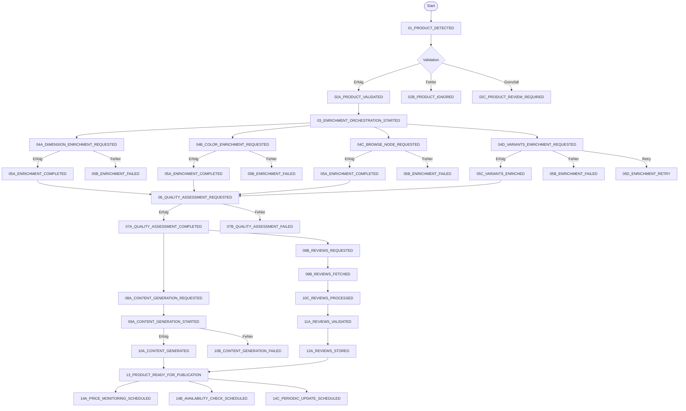

# Event Flow Diagram - Tall Affiliate System

## Übersicht

Dieses Dokument beschreibt die standardisierte Event-Reihenfolge im Tall Affiliate System. Events folgen einer festen Nummerierung mit Optionen für alternative Pfade.

## Event-Namenskonvention

### Format: `[Nummer]_[Option]_EVENT_NAME`

- **Nummer**: Zweistellige Sequenznummer (01, 02, 03...)
- **Option**: Buchstabe für alternative Pfade (A, B, C...)
  - A = Hauptpfad (Erfolg)
  - B = Alternativer Pfad (Fehler/Ablehnung)
  - C = Manueller Eingriff erforderlich
  - D = Retry/Wiederholung

## Event-Flow Diagramm



## Detaillierte Event-Beschreibungen

### Phase 1: Produktentdeckung (01-02)

#### 01_PRODUCT_DETECTED
- **Stream**: `stream:product_lifecycle`
- **Beschreibung**: Neues Produkt von Amazon Scraper entdeckt
- **Payload**:
```json
{
  "asin": "B07XQXZXJC",
  "title": "Tall Men's Jeans",
  "price": 79.99,
  "currency": "EUR",
  "images": ["url1", "url2"],
  "features": ["Extra Long", "34 inch inseam"]
}
```

#### 02A_PRODUCT_VALIDATED
- **Stream**: `stream:product_lifecycle`
- **Beschreibung**: Produkt erfüllt alle Qualitätskriterien
- **Nächster Schritt**: Enrichment Pipeline

#### 02B_PRODUCT_IGNORED
- **Stream**: `stream:product_lifecycle`
- **Beschreibung**: Produkt erfüllt Kriterien nicht
- **Gründe**: Keine Größeninfo, keine Reviews, Preis außerhalb Range
- **Ende**: Produkt wird nicht weiter verarbeitet

#### 02C_PRODUCT_REVIEW_REQUIRED
- **Stream**: `stream:product_lifecycle`
- **Beschreibung**: Manuelle Überprüfung erforderlich
- **Aktion**: Wartet auf menschliche Entscheidung

### Phase 2: Anreicherung (03-05)

#### 03_ENRICHMENT_ORCHESTRATION_STARTED
- **Stream**: `stream:product_lifecycle`
- **Beschreibung**: Startet parallele Anreicherungsprozesse

#### 04A_DIMENSION_ENRICHMENT_REQUESTED
- **Stream**: `stream:enrichment`
- **Beschreibung**: Amazon Scraping für physische Maße
- **Parallel zu**: 04B, 04C, 04D

#### 04B_COLOR_ENRICHMENT_REQUESTED  
- **Stream**: `stream:enrichment`
- **Beschreibung**: PA-API Aufruf für Hauptfarbe
- **Parallel zu**: 04A, 04C, 04D

#### 04C_BROWSE_NODE_REQUESTED
- **Stream**: `stream:browse_nodes`
- **Beschreibung**: Kategorisierung anfordern
- **Parallel zu**: 04A, 04B, 04D

#### 04D_VARIANTS_ENRICHMENT_REQUESTED
- **Stream**: `stream:enrichment`
- **Beschreibung**: PA-API Aufruf für Farb- und Bildvarianten (ein einziger API-Call)
- **Payload**: Holt gleichzeitig color_variants und image_variants
- **Parallel zu**: 04A, 04B, 04C

#### 05A_ENRICHMENT_COMPLETED
- **Stream**: `stream:enrichment`
- **Beschreibung**: Erfolgreiche Anreicherung
- **Payload**: Je nach Event-Typ (Dimensions, Colors, BrowseNodes, Variants)

#### 05B_ENRICHMENT_FAILED
- **Stream**: `stream:enrichment`
- **Fehlertypen**: RequestThrottled, InvalidParameterValue
- **Aktion**: Bei throttling → 05D_ENRICHMENT_RETRY

#### 05C_VARIANTS_ENRICHED
- **Stream**: `stream:enrichment`
- **Beschreibung**: Farb- und Bildvarianten erfolgreich angereichert
- **Payload**:
```json
{
  "color_variants": ["Black", "Navy", "Grey"],
  "image_variants": {
    "Black": ["url1", "url2"],
    "Navy": ["url3", "url4"],
    "Grey": ["url5", "url6"]
  }
}
```

#### 05D_ENRICHMENT_RETRY
- **Stream**: `stream:enrichment`
- **Retry-Strategie**: Exponential backoff (30s, 60s, 120s)
- **Max Retries**: 3

### Phase 3: Qualitätsbewertung (06-07)

#### 06_QUALITY_ASSESSMENT_REQUESTED
- **Stream**: `stream:quality`
- **Beschreibung**: Bewertet angereicherte Produktdaten
- **Wartet auf**: Alle Enrichment-Events

#### 07A_QUALITY_ASSESSMENT_COMPLETED
- **Stream**: `stream:quality`
- **Payload**:
```json
{
  "quality_score": 8.5,
  "status": "validated",
  "tall_friendly_score": 9.2
}
```

### Phase 4: Content & Reviews (08-12)

#### 08A_CONTENT_GENERATION_REQUESTED
- **Stream**: `stream:content_generation`
- **Parallel zu**: 08B_REVIEWS_REQUESTED

#### 09A_CONTENT_GENERATION_STARTED
- **Stream**: `stream:content_generation`
- **Beschreibung**: AI-Content-Generierung läuft

#### 10A_CONTENT_GENERATED
- **Stream**: `stream:content_generation`
- **Content-Typen**: Description, FAQ, Size Guide

#### 08B_REVIEWS_REQUESTED
- **Stream**: `stream:reviews`
- **Parallel zu**: 08A_CONTENT_GENERATION_REQUESTED

#### 09B_REVIEWS_FETCHED → 10C_REVIEWS_PROCESSED → 11A_REVIEWS_VALIDATED → 12A_REVIEWS_STORED
- **Stream**: `stream:reviews`
- **Pipeline**: Sammlung → Verarbeitung → Validierung → Speicherung

### Phase 5: Publikation & Monitoring (13-14)

#### 13_PRODUCT_READY_FOR_PUBLICATION
- **Stream**: `stream:product_lifecycle`
- **Beschreibung**: Alle Daten komplett, bereit für Website

#### 14A_PRICE_MONITORING_SCHEDULED
- **Stream**: `stream:monitoring`
- **Intervall**: Täglich

#### 14B_AVAILABILITY_CHECK_SCHEDULED
- **Stream**: `stream:monitoring`
- **Intervall**: Alle 6 Stunden

#### 14C_PERIODIC_UPDATE_SCHEDULED
- **Stream**: `stream:monitoring`
- **Intervall**: Wöchentlich

## Stream-Zuordnung

| Stream | Event-Nummern | Beschreibung |
|--------|--------------|--------------|
| `stream:product_lifecycle` | 01, 02A/B/C, 03, 13 | Hauptprodukt-Events |
| `stream:enrichment` | 04A/B, 05A/B/D | Anreicherungsprozesse |
| `stream:browse_nodes` | 04C, 05A/B | Kategorisierung |
| `stream:quality` | 06, 07A/B | Qualitätsbewertung |
| `stream:content_generation` | 08A, 09A, 10A/B | Content-Erstellung |
| `stream:reviews` | 08B, 09B, 10C, 11A, 12A | Review-Pipeline |
| `stream:monitoring` | 14A/B/C | Kontinuierliche Überwachung |

## Implementierungsvorschlag

### Event-Konstanten Update

```go
// Phase 1: Discovery
const (
    Event_01_ProductDetected        = "01_PRODUCT_DETECTED"
    Event_02A_ProductValidated      = "02A_PRODUCT_VALIDATED"
    Event_02B_ProductIgnored        = "02B_PRODUCT_IGNORED"
    Event_02C_ProductReviewRequired = "02C_PRODUCT_REVIEW_REQUIRED"
)

// Phase 2: Enrichment
const (
    Event_03_EnrichmentOrchestrationStarted = "03_ENRICHMENT_ORCHESTRATION_STARTED"
    // Event_04A_DimensionEnrichmentRequested removed - use PA-API enrichment
    Event_04B_ColorEnrichmentRequested      = "04B_COLOR_ENRICHMENT_REQUESTED"
    Event_04C_BrowseNodeRequested           = "04C_BROWSE_NODE_REQUESTED"
    Event_05A_EnrichmentCompleted           = "05A_ENRICHMENT_COMPLETED"
    Event_05B_EnrichmentFailed              = "05B_ENRICHMENT_FAILED"
    Event_05D_EnrichmentRetry               = "05D_ENRICHMENT_RETRY"
)

// Phase 3: Quality Assessment
const (
    Event_06_QualityAssessmentRequested = "06_QUALITY_ASSESSMENT_REQUESTED"
    Event_07A_QualityAssessmentCompleted = "07A_QUALITY_ASSESSMENT_COMPLETED"
    Event_07B_QualityAssessmentFailed    = "07B_QUALITY_ASSESSMENT_FAILED"
)

// Phase 4: Content & Reviews
const (
    Event_08A_ContentGenerationRequested = "08A_CONTENT_GENERATION_REQUESTED"
    Event_08B_ReviewsRequested           = "08B_REVIEWS_REQUESTED"
    Event_09A_ContentGenerationStarted   = "09A_CONTENT_GENERATION_STARTED"
    Event_09B_ReviewsFetched             = "09B_REVIEWS_FETCHED"
    Event_10A_ContentGenerated           = "10A_CONTENT_GENERATED"
    Event_10B_ContentGenerationFailed    = "10B_CONTENT_GENERATION_FAILED"
    Event_10C_ReviewsProcessed           = "10C_REVIEWS_PROCESSED"
    Event_11A_ReviewsValidated           = "11A_REVIEWS_VALIDATED"
    Event_12A_ReviewsStored              = "12A_REVIEWS_STORED"
)

// Phase 5: Publication & Monitoring
const (
    Event_13_ProductReadyForPublication = "13_PRODUCT_READY_FOR_PUBLICATION"
    Event_14A_PriceMonitoringScheduled  = "14A_PRICE_MONITORING_SCHEDULED"
    Event_14B_AvailabilityCheckScheduled = "14B_AVAILABILITY_CHECK_SCHEDULED"
    Event_14C_PeriodicUpdateScheduled   = "14C_PERIODIC_UPDATE_SCHEDULED"
)
```

## Vorteile dieser Konvention

1. **Klare Reihenfolge**: Nummer zeigt Position im Flow
2. **Alternative Pfade**: Buchstaben zeigen verschiedene Ausgänge
3. **Einfache Sortierung**: Events sortieren sich automatisch richtig
4. **Debugging**: Sofort erkennbar, wo im Flow ein Event steht
5. **Erweiterbar**: Neue Events können mit Zwischennummern eingefügt werden (z.B. 03.5)

## Migration

Für die Migration der bestehenden Event-Namen:

1. Neue Konstanten parallel zu alten definieren
2. Mapping-Funktion für Übergangsphase
3. Schrittweise Migration pro Service
4. Alte Konstanten nach Abschluss deprecaten

## Monitoring & Metriken

Mit dieser Konvention können Metriken einfach gruppiert werden:

- **Phase-Metriken**: Events 01-02 (Discovery), 03-05 (Enrichment), etc.
- **Erfolgsrate**: Verhältnis A-Events zu B-Events
- **Retry-Rate**: Anzahl D-Events
- **Manuelle Eingriffe**: Anzahl C-Events

---

*Version 1.0 - Stand: Januar 2025*