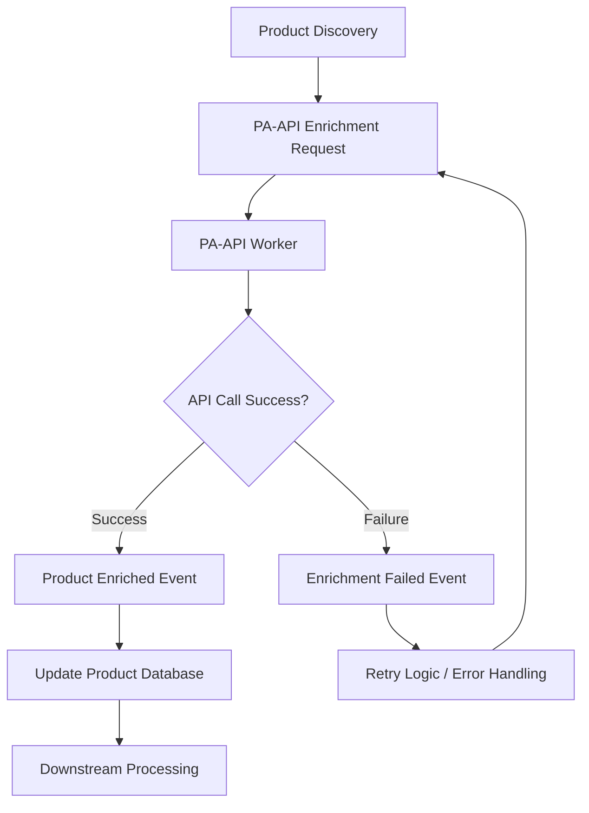

# PA-API Enrichment Architecture

## Overview

The PA-API (Product Advertising API) Enrichment system extends the tall-affiliate-common package with specialized event types and data structures for Amazon Product Advertising API integration. This system enables asynchronous product enrichment workflows using event-driven architecture.

## Architecture Components

### Event-Driven Flow



### Core Event Types

The PA-API enrichment system introduces three primary CloudEvent-compatible event types:

1. **ProductEnrichmentRequestedV1** (`product.enrichment.requested.v1`)
   - Triggers PA-API enrichment process
   - Contains ASIN, region, and request metadata

2. **ProductEnrichmentCompletedV1** (`product.enrichment.completed.v1`)
   - Indicates successful PA-API enrichment
   - Contains enriched product data including color variants and images

3. **ProductEnrichmentFailedV1** (`product.enrichment.failed.v1`)
   - Indicates failed PA-API enrichment attempt
   - Contains error details and retry information

## Data Structures

### ProductEnrichmentRequestedData

```go
type ProductEnrichmentRequestedData struct {
    ASIN       string `json:"asin"`        // Amazon product identifier
    Region     string `json:"region"`      // AWS region for PA-API
    RequestID  string `json:"request_id"`  // Unique request identifier
    RetryCount int    `json:"retry_count"` // Current retry attempt
}
```

**Validation Rules:**
- `ASIN`: Required, Amazon Standard Identification Number
- `Region`: Required, AWS region code (e.g., "us-east-1")  
- `RequestID`: Required, UUID for request tracking

### ProductEnrichedData

```go
type ProductEnrichedData struct {
    ASIN          string         `json:"asin"`
    Region        string         `json:"region"`
    RequestID     string         `json:"request_id"`
    ColorVariants []ColorVariant `json:"color_variants"`
    ProcessingMS  int64          `json:"processing_ms"`
    EnrichedAt    time.Time      `json:"enriched_at"`
}
```

### ColorVariant & ImageSet

```go
type ColorVariant struct {
    ColorName string     `json:"color_name"`
    ASIN      string     `json:"asin"`
    Images    []ImageSet `json:"images"`
}

type ImageSet struct {
    Small  string `json:"small"`  // Small image URL
    Medium string `json:"medium"` // Medium image URL  
    Large  string `json:"large"`  // Large image URL
}
```

### ProductEnrichmentFailedData

```go
type ProductEnrichmentFailedData struct {
    ASIN         string    `json:"asin"`
    Region       string    `json:"region"`
    RequestID    string    `json:"request_id"`
    ErrorCode    string    `json:"error_code"`    // PA-API error code
    ErrorMessage string    `json:"error_message"` // Human-readable error
    FailedAt     time.Time `json:"failed_at"`
    RetryCount   int       `json:"retry_count"`
}
```

## Integration Workflow

### 1. Enrichment Request Flow

```go
// Create enrichment request
requestData := &ProductEnrichmentRequestedData{
    ASIN:       "B07PXGQC1Q",
    Region:     "us-east-1", 
    RequestID:  uuid.New().String(),
    RetryCount: 0,
}

// Create event
event, err := NewProductEnrichmentRequestedEvent("product-service", requestData)
if err != nil {
    return err
}

// Publish to Redis Stream
streamProducer.Publish("pa-api-requests", event)
```

### 2. PA-API Worker Processing

The PA-API Worker:

1. **Consumes** `ProductEnrichmentRequestedV1` events from Redis Stream
2. **Validates** request data (ASIN, region, request ID)
3. **Calls** Amazon PA-API with appropriate parameters
4. **Processes** API response to extract color variants and images
5. **Publishes** success/failure events based on outcome

### 3. Success Response Handling

```go
// On successful PA-API response
enrichedData := &ProductEnrichedData{
    ASIN:          request.ASIN,
    Region:        request.Region,
    RequestID:     request.RequestID,
    ColorVariants: extractedVariants,
    ProcessingMS:  processingTime,
    EnrichedAt:    time.Now().UTC(),
}

event, _ := NewProductEnrichedEvent("pa-api-worker", enrichedData)
streamProducer.Publish("product-enriched", event)
```

### 4. Error Handling

```go
// On PA-API failure
failedData := &ProductEnrichmentFailedData{
    ASIN:         request.ASIN,
    Region:       request.Region,
    RequestID:    request.RequestID,
    ErrorCode:    "InvalidParameterValue",
    ErrorMessage: "The ItemId B07PXGQC1Q provided in the request is invalid",
    FailedAt:     time.Now().UTC(),
    RetryCount:   request.RetryCount + 1,
}

event, _ := NewProductEnrichmentFailedEvent("pa-api-worker", failedData)
streamProducer.Publish("product-enrichment-failed", event)
```

## Event Constructor Functions

### NewProductEnrichmentRequestedEvent

```go
func NewProductEnrichmentRequestedEvent(source string, data *ProductEnrichmentRequestedData) (*Event, error)
```

- **Validates** input data using `data.Validate()`
- **Creates** CloudEvent-compatible event
- **Returns** error if validation fails

### NewProductEnrichedEvent

```go
func NewProductEnrichedEvent(source string, data *ProductEnrichedData) (*Event, error)
```

- **Creates** success event with enriched product data
- **Includes** processing metrics and timestamps

### NewProductEnrichmentFailedEvent

```go
func NewProductEnrichmentFailedEvent(source string, data *ProductEnrichmentFailedData) (*Event, error)
```

- **Creates** failure event with error details
- **Supports** retry logic with retry count tracking

## Redis Stream Integration

### Stream Names

- **Request Stream**: `pa-api-requests`
  - Events: `ProductEnrichmentRequestedV1`
  - Consumer: PA-API Worker

- **Success Stream**: `product-enriched`  
  - Events: `ProductEnrichmentCompletedV1`
  - Consumers: Product Service, Analytics Service

- **Failure Stream**: `product-enrichment-failed`
  - Events: `ProductEnrichmentFailedV1`
  - Consumers: Retry Service, Monitoring Service

### Consumer Group Configuration

```yaml
pa-api-worker:
  stream: pa-api-requests
  consumer_group: pa-api-workers
  max_retries: 3
  retry_delay: 30s
  batch_size: 10
```

## Error Handling & Retry Strategy

### Retry Logic

1. **Exponential Backoff**: 30s, 60s, 120s delays
2. **Max Retries**: 3 attempts per request
3. **Dead Letter Queue**: Failed requests after max retries
4. **Error Classification**: 
   - Retriable: Rate limits, temporary API issues
   - Non-retriable: Invalid ASINs, authentication errors

### Monitoring & Alerting

- **Success Rate**: Track enrichment success percentage
- **Processing Time**: Monitor PA-API response times
- **Error Rates**: Alert on high failure rates
- **Queue Depth**: Monitor request queue buildup

## CloudEvent Compatibility

All PA-API enrichment events follow CloudEvent specification v1.0:

```json
{
  "specversion": "1.0",
  "type": "product.enrichment.requested.v1",
  "source": "product-service",
  "id": "550e8400-e29b-41d4-a716-446655440000",
  "time": "2025-08-15T13:30:00Z",
  "datacontenttype": "application/json",
  "data": {
    "asin": "B07PXGQC1Q",
    "region": "us-east-1",
    "request_id": "req-123456",
    "retry_count": 0
  }
}
```

## Testing Strategy

### Unit Tests

- Event creation and validation
- Data structure serialization/deserialization
- Constructor function error handling

### Integration Tests

- Redis Stream publish/consume workflows
- PA-API Worker event processing
- End-to-end enrichment scenarios

### Load Testing

- High-volume request processing
- Concurrent worker performance
- Redis Stream throughput limits

## Security Considerations

### PA-API Credentials

- **Secure Storage**: AWS Secrets Manager or HashiCorp Vault
- **Rotation**: Automated credential rotation
- **Least Privilege**: Minimal required permissions

### Event Data

- **No Sensitive Data**: Events contain only public product information
- **Request Tracking**: UUIDs for correlation, not user data
- **Audit Logging**: All enrichment activities logged

## Performance Optimization

### Caching Strategy

- **Product Cache**: Cache enriched data for 24 hours
- **Error Cache**: Cache failed ASINs to avoid repeated failures
- **Rate Limiting**: Respect PA-API rate limits (1 TPS)

### Batch Processing

- **Bulk Requests**: Group multiple ASINs per PA-API call
- **Worker Scaling**: Horizontal scaling based on queue depth
- **Connection Pooling**: Reuse HTTP connections to PA-API

## Migration from Legacy Events

### Compatibility Layer

Existing `VariationEnrichment*` events remain supported:

```go
// Legacy event mapping
VariationEnrichmentRequested → ProductEnrichmentRequestedV1
VariationEnrichmentCompleted → ProductEnrichmentCompletedV1  
VariationEnrichmentFailed    → ProductEnrichmentFailedV1
```

### Migration Timeline

1. **Phase 1**: Deploy new events alongside legacy (current)
2. **Phase 2**: Update consumers to handle both event types
3. **Phase 3**: Migrate producers to new event format
4. **Phase 4**: Deprecate legacy events (6 months)

## Conclusion

The PA-API Enrichment system provides a robust, scalable foundation for Amazon product data enrichment using event-driven architecture. The CloudEvent-compatible format ensures interoperability while the comprehensive error handling and retry mechanisms ensure reliability at scale.

For implementation questions or issues, refer to the API documentation or contact the platform team.