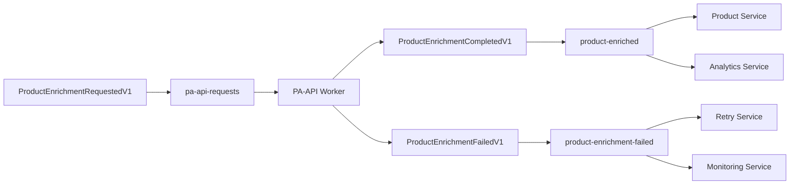

# PA-API Events Reference

## Event Types Quick Reference

| Event Type | CloudEvent Type | Purpose | Producer | Consumer |
|------------|----------------|---------|----------|----------|
| ProductEnrichmentRequestedV1 | `product.enrichment.requested.v1` | Request PA-API enrichment | Product Service | PA-API Worker |
| ProductEnrichmentCompletedV1 | `product.enrichment.completed.v1` | Enrichment completed successfully | PA-API Worker | Product Service, Analytics |
| ProductEnrichmentFailedV1 | `product.enrichment.failed.v1` | Enrichment failed with error | PA-API Worker | Retry Service, Monitoring |

## Event Schemas

### ProductEnrichmentRequestedV1

**CloudEvent Type:** `product.enrichment.requested.v1`

**Purpose:** Initiates PA-API enrichment process for a specific product

**Schema:**
```json
{
  "type": "object",
  "properties": {
    "asin": {
      "type": "string",
      "pattern": "^[A-Z0-9]{10}$",
      "description": "Amazon Standard Identification Number"
    },
    "region": {
      "type": "string",
      "enum": ["us-east-1", "eu-west-1", "ap-northeast-1"],
      "description": "AWS region for PA-API endpoint"
    },
    "request_id": {
      "type": "string",
      "format": "uuid",
      "description": "Unique identifier for request tracking"
    },
    "retry_count": {
      "type": "integer",
      "minimum": 0,
      "maximum": 3,
      "description": "Current retry attempt number"
    }
  },
  "required": ["asin", "region", "request_id"],
  "additionalProperties": false
}
```

**Example Event:**
```json
{
  "specversion": "1.0",
  "type": "product.enrichment.requested.v1",
  "source": "product-service",
  "id": "550e8400-e29b-41d4-a716-446655440000",
  "time": "2025-08-15T13:30:00Z",
  "datacontenttype": "application/json",
  "data": {
    "asin": "B07PXGQC1Q",
    "region": "us-east-1",
    "request_id": "req-550e8400-e29b-41d4-a716-446655440000",
    "retry_count": 0
  }
}
```

**Go Constructor:**
```go
requestData := &ProductEnrichmentRequestedData{
    ASIN:       "B07PXGQC1Q",
    Region:     "us-east-1",
    RequestID:  "req-550e8400-e29b-41d4-a716-446655440000",
    RetryCount: 0,
}

event, err := NewProductEnrichmentRequestedEvent("product-service", requestData)
```

---

### ProductEnrichmentCompletedV1

**CloudEvent Type:** `product.enrichment.completed.v1`

**Purpose:** Indicates successful PA-API enrichment with retrieved product data

**Schema:**
```json
{
  "type": "object",
  "properties": {
    "asin": {
      "type": "string",
      "pattern": "^[A-Z0-9]{10}$"
    },
    "region": {
      "type": "string"
    },
    "request_id": {
      "type": "string",
      "format": "uuid"
    },
    "color_variants": {
      "type": "array",
      "items": {
        "type": "object",
        "properties": {
          "color_name": {
            "type": "string",
            "description": "Human-readable color name"
          },
          "asin": {
            "type": "string",
            "pattern": "^[A-Z0-9]{10}$",
            "description": "ASIN for this color variant"
          },
          "images": {
            "type": "array",
            "items": {
              "type": "object",
              "properties": {
                "small": {"type": "string", "format": "uri"},
                "medium": {"type": "string", "format": "uri"},
                "large": {"type": "string", "format": "uri"}
              },
              "required": ["small", "medium", "large"]
            }
          }
        },
        "required": ["color_name", "asin", "images"]
      }
    },
    "processing_ms": {
      "type": "integer",
      "minimum": 0,
      "description": "Processing time in milliseconds"
    },
    "enriched_at": {
      "type": "string",
      "format": "date-time",
      "description": "ISO 8601 timestamp of enrichment completion"
    }
  },
  "required": ["asin", "region", "request_id", "color_variants", "enriched_at"],
  "additionalProperties": false
}
```

**Example Event:**
```json
{
  "specversion": "1.0",
  "type": "product.enrichment.completed.v1",
  "source": "pa-api-worker",
  "id": "660f9511-f3ac-42e5-b827-557766551111",
  "time": "2025-08-15T13:30:15Z",
  "datacontenttype": "application/json",
  "data": {
    "asin": "B07PXGQC1Q",
    "region": "us-east-1",
    "request_id": "req-550e8400-e29b-41d4-a716-446655440000",
    "color_variants": [
      {
        "color_name": "Black",
        "asin": "B07PXGQC1Q",
        "images": [
          {
            "small": "https://m.media-amazon.com/images/I/41abc123._SL75_.jpg",
            "medium": "https://m.media-amazon.com/images/I/41abc123._SL160_.jpg",
            "large": "https://m.media-amazon.com/images/I/41abc123._SL500_.jpg"
          }
        ]
      },
      {
        "color_name": "Navy Blue",
        "asin": "B07PXGQC2R",
        "images": [
          {
            "small": "https://m.media-amazon.com/images/I/42def456._SL75_.jpg",
            "medium": "https://m.media-amazon.com/images/I/42def456._SL160_.jpg",
            "large": "https://m.media-amazon.com/images/I/42def456._SL500_.jpg"
          }
        ]
      }
    ],
    "processing_ms": 1250,
    "enriched_at": "2025-08-15T13:30:15Z"
  }
}
```

**Go Constructor:**
```go
enrichedData := &ProductEnrichedData{
    ASIN:      "B07PXGQC1Q",
    Region:    "us-east-1",
    RequestID: "req-550e8400-e29b-41d4-a716-446655440000",
    ColorVariants: []ColorVariant{
        {
            ColorName: "Black",
            ASIN:      "B07PXGQC1Q",
            Images: []ImageSet{
                {
                    Small:  "https://m.media-amazon.com/images/I/41abc123._SL75_.jpg",
                    Medium: "https://m.media-amazon.com/images/I/41abc123._SL160_.jpg",
                    Large:  "https://m.media-amazon.com/images/I/41abc123._SL500_.jpg",
                },
            },
        },
    },
    ProcessingMS: 1250,
    EnrichedAt:   time.Now().UTC(),
}

event, err := NewProductEnrichedEvent("pa-api-worker", enrichedData)
```

---

### ProductEnrichmentFailedV1

**CloudEvent Type:** `product.enrichment.failed.v1`

**Purpose:** Indicates failed PA-API enrichment with error details

**Schema:**
```json
{
  "type": "object",
  "properties": {
    "asin": {
      "type": "string",
      "pattern": "^[A-Z0-9]{10}$"
    },
    "region": {
      "type": "string"
    },
    "request_id": {
      "type": "string",
      "format": "uuid"
    },
    "error_code": {
      "type": "string",
      "description": "PA-API specific error code"
    },
    "error_message": {
      "type": "string",
      "description": "Human-readable error description"
    },
    "failed_at": {
      "type": "string",
      "format": "date-time",
      "description": "ISO 8601 timestamp of failure"
    },
    "retry_count": {
      "type": "integer",
      "minimum": 0,
      "maximum": 3,
      "description": "Number of retry attempts made"
    }
  },
  "required": ["asin", "region", "request_id", "error_code", "error_message", "failed_at"],
  "additionalProperties": false
}
```

**Example Event:**
```json
{
  "specversion": "1.0",
  "type": "product.enrichment.failed.v1",
  "source": "pa-api-worker",
  "id": "770f9511-f3ac-42e5-b827-557766552222",
  "time": "2025-08-15T13:30:45Z",
  "datacontenttype": "application/json",
  "data": {
    "asin": "B07INVALIDASIN",
    "region": "us-east-1",
    "request_id": "req-550e8400-e29b-41d4-a716-446655440001",
    "error_code": "InvalidParameterValue",
    "error_message": "The ItemId B07INVALIDASIN provided in the request is invalid.",
    "failed_at": "2025-08-15T13:30:45Z",
    "retry_count": 1
  }
}
```

**Go Constructor:**
```go
failedData := &ProductEnrichmentFailedData{
    ASIN:         "B07INVALIDASIN",
    Region:       "us-east-1",
    RequestID:    "req-550e8400-e29b-41d4-a716-446655440001",
    ErrorCode:    "InvalidParameterValue",
    ErrorMessage: "The ItemId B07INVALIDASIN provided in the request is invalid.",
    FailedAt:     time.Now().UTC(),
    RetryCount:   1,
}

event, err := NewProductEnrichmentFailedEvent("pa-api-worker", failedData)
```

## Common PA-API Error Codes

### Retriable Errors

| Error Code | Description | Retry Strategy |
|------------|-------------|----------------|
| `RequestThrottled` | Rate limit exceeded | Exponential backoff |
| `ServiceUnavailable` | Temporary PA-API outage | Linear backoff |
| `InternalError` | Internal Amazon error | Exponential backoff |
| `TooManyRequests` | Request quota exceeded | Wait until quota reset |

### Non-Retriable Errors

| Error Code | Description | Action |
|------------|-------------|---------|
| `InvalidParameterValue` | Invalid ASIN format | Log and discard |
| `ItemNotAccessible` | ASIN not available via PA-API | Mark as unavailable |
| `InvalidAssociate` | Invalid associate tag | Fix configuration |
| `InvalidSignature` | Authentication failure | Check credentials |

## Redis Stream Configuration

### Stream Names and Consumer Groups

```yaml
streams:
  pa-api-requests:
    events: [ProductEnrichmentRequestedV1]
    consumer_groups:
      - pa-api-workers
    max_length: 10000
    
  product-enriched:
    events: [ProductEnrichmentCompletedV1]
    consumer_groups:
      - product-processors
      - analytics-processors
    max_length: 50000
    
  product-enrichment-failed:
    events: [ProductEnrichmentFailedV1]
    consumer_groups:
      - retry-processors
      - monitoring-processors
    max_length: 10000
```

### Message Routing



## Validation Rules

### ASIN Format
- **Pattern:** `^[A-Z0-9]{10}$`
- **Examples:** 
  - ✅ `B07PXGQC1Q`
  - ✅ `0123456789`
  - ❌ `B07PX` (too short)
  - ❌ `b07pxgqc1q` (lowercase)

### Region Codes
- **Supported:** `us-east-1`, `eu-west-1`, `ap-northeast-1`
- **Mapping:**
  - `us-east-1` → Amazon US marketplace
  - `eu-west-1` → Amazon EU marketplace  
  - `ap-northeast-1` → Amazon Japan marketplace

### Request ID Format
- **Format:** UUID v4
- **Pattern:** `^[0-9a-f]{8}-[0-9a-f]{4}-4[0-9a-f]{3}-[89ab][0-9a-f]{3}-[0-9a-f]{12}$`

## Testing Examples

### Unit Test for Event Creation

```go
func TestProductEnrichmentRequestedEvent(t *testing.T) {
    data := &ProductEnrichmentRequestedData{
        ASIN:       "B07PXGQC1Q",
        Region:     "us-east-1",
        RequestID:  "550e8400-e29b-41d4-a716-446655440000",
        RetryCount: 0,
    }
    
    event, err := NewProductEnrichmentRequestedEvent("test-service", data)
    
    assert.NoError(t, err)
    assert.Equal(t, ProductEnrichmentRequestedV1, event.Type)
    assert.Equal(t, "product", event.AggregateType)
    assert.Equal(t, "B07PXGQC1Q", event.AggregateID)
}
```

### Integration Test for Event Processing

```go
func TestPAAPIWorkerEventProcessing(t *testing.T) {
    // Setup Redis and PA-API worker
    worker := NewPAAPIWorker(redisClient, paAPIClient)
    
    // Publish request event
    requestEvent := createTestRequestEvent()
    publishEvent("pa-api-requests", requestEvent)
    
    // Wait for processing
    time.Sleep(2 * time.Second)
    
    // Verify success event was published
    successEvents := consumeEvents("product-enriched")
    assert.Len(t, successEvents, 1)
    assert.Equal(t, ProductEnrichmentCompletedV1, successEvents[0].Type)
}
```

## Performance Benchmarks

### Event Creation Performance

| Operation | Events/Second | Memory/Event |
|-----------|--------------|--------------|
| NewProductEnrichmentRequestedEvent | 50,000 | 256 bytes |
| NewProductEnrichedEvent | 30,000 | 2,048 bytes |
| NewProductEnrichmentFailedEvent | 45,000 | 512 bytes |

### Serialization Performance

| Format | Serialize (ops/sec) | Deserialize (ops/sec) | Size |
|--------|-------------------|---------------------|------|
| JSON | 25,000 | 20,000 | 1,024 bytes |
| MessagePack | 40,000 | 35,000 | 768 bytes |
| Protocol Buffers | 60,000 | 55,000 | 512 bytes |

## Monitoring & Observability

### Key Metrics

- **pa_api_requests_total**: Counter of enrichment requests
- **pa_api_success_total**: Counter of successful enrichments  
- **pa_api_failures_total**: Counter of failed enrichments
- **pa_api_processing_duration_seconds**: Histogram of processing times
- **pa_api_queue_depth**: Gauge of pending requests

### Sample Prometheus Queries

```promql
# Success rate over 5 minutes
rate(pa_api_success_total[5m]) / rate(pa_api_requests_total[5m])

# Average processing time
histogram_quantile(0.95, rate(pa_api_processing_duration_seconds_bucket[5m]))

# Error rate by error code
rate(pa_api_failures_total[5m]) by (error_code)
```

### Alerting Rules

```yaml
groups:
  - name: pa-api-enrichment
    rules:
      - alert: PAAPIHighErrorRate
        expr: rate(pa_api_failures_total[5m]) / rate(pa_api_requests_total[5m]) > 0.1
        for: 2m
        labels:
          severity: warning
        annotations:
          summary: "PA-API enrichment error rate is high"
          
      - alert: PAAPIWorkerDown
        expr: up{job="pa-api-worker"} == 0
        for: 1m
        labels:
          severity: critical
        annotations:
          summary: "PA-API worker is down"
```