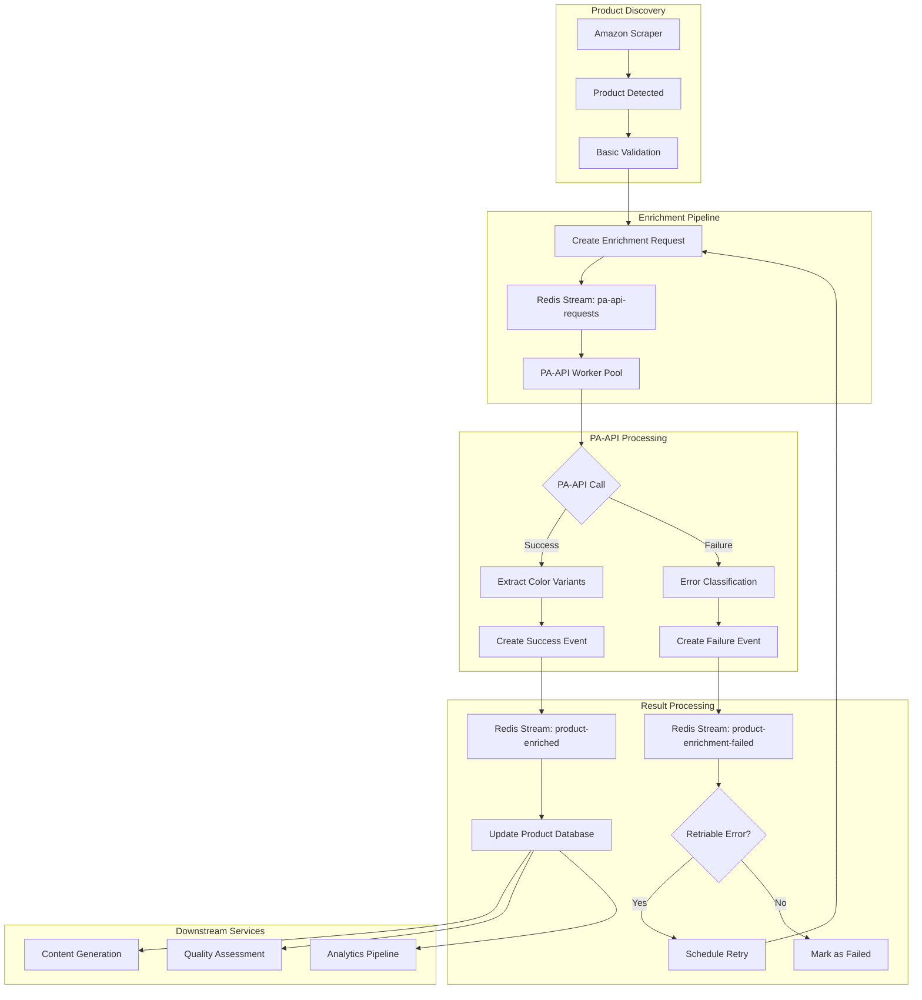

# PA-API Workflow Integration Guide

## Overview

This guide explains how to integrate the PA-API enrichment workflow into existing tall-affiliate systems. The workflow follows event-driven architecture principles using Redis Streams for reliable message delivery.

## Integration Architecture



## Step-by-Step Integration

### 1. Producer Integration (Product Service)

#### Initialize PA-API Enrichment Request

```go
package main

import (
    "context"
    "log"
    "time"
    
    "github.com/MalteBoehm/tall-affiliate-common/pkg/events"
    "github.com/MalteBoehm/tall-affiliate-common/pkg/redis"
    "github.com/google/uuid"
)

type ProductService struct {
    streamProducer *redis.StreamProducer
}

func (ps *ProductService) RequestProductEnrichment(asin, region string) error {
    // Create enrichment request data
    requestData := &events.ProductEnrichmentRequestedData{
        ASIN:       asin,
        Region:     region,
        RequestID:  uuid.New().String(),
        RetryCount: 0,
    }
    
    // Validate data
    if err := requestData.Validate(); err != nil {
        return fmt.Errorf("invalid request data: %w", err)
    }
    
    // Create event
    event, err := events.NewProductEnrichmentRequestedEvent("product-service", requestData)
    if err != nil {
        return fmt.Errorf("failed to create event: %w", err)
    }
    
    // Publish to Redis Stream
    streamName := "pa-api-requests"
    if err := ps.streamProducer.Publish(context.Background(), streamName, event); err != nil {
        return fmt.Errorf("failed to publish event: %w", err)
    }
    
    log.Printf("PA-API enrichment requested for ASIN: %s, RequestID: %s", asin, requestData.RequestID)
    return nil
}
```

#### Batch Request Processing

```go
func (ps *ProductService) RequestBatchEnrichment(asins []string, region string) error {
    ctx := context.Background()
    streamName := "pa-api-requests"
    
    // Create events for all ASINs
    events := make([]*events.Event, len(asins))
    for i, asin := range asins {
        requestData := &events.ProductEnrichmentRequestedData{
            ASIN:       asin,
            Region:     region,
            RequestID:  uuid.New().String(),
            RetryCount: 0,
        }
        
        event, err := events.NewProductEnrichmentRequestedEvent("product-service", requestData)
        if err != nil {
            log.Printf("Failed to create event for ASIN %s: %v", asin, err)
            continue
        }
        events[i] = event
    }
    
    // Publish batch
    return ps.streamProducer.PublishBatch(ctx, streamName, events)
}
```

### 2. PA-API Worker Implementation

#### Core Worker Structure

```go
package main

import (
    "context"
    "encoding/json"
    "log"
    "time"
    
    "github.com/MalteBoehm/tall-affiliate-common/pkg/events"
    "github.com/MalteBoehm/tall-affiliate-common/pkg/redis"
)

type PAAPIWorker struct {
    consumer       *redis.StreamConsumer
    producer       *redis.StreamProducer
    paAPIClient    *PAAPIClient // Your PA-API client
    workerID       string
}

func NewPAAPIWorker(redisClient *redis.Client, paAPIClient *PAAPIClient) *PAAPIWorker {
    return &PAAPIWorker{
        consumer:    redis.NewStreamConsumer(redisClient, "pa-api-workers"),
        producer:    redis.NewStreamProducer(redisClient),
        paAPIClient: paAPIClient,
        workerID:    fmt.Sprintf("worker-%s", uuid.New().String()[:8]),
    }
}

func (w *PAAPIWorker) Start(ctx context.Context) error {
    streamName := "pa-api-requests"
    consumerGroup := "pa-api-workers"
    
    return w.consumer.Consume(ctx, streamName, consumerGroup, w.workerID, w.processEvent)
}

func (w *PAAPIWorker) processEvent(ctx context.Context, event *events.Event) error {
    startTime := time.Now()
    
    // Parse request data
    var requestData events.ProductEnrichmentRequestedData
    if err := event.UnmarshalPayload(&requestData); err != nil {
        return fmt.Errorf("failed to unmarshal request: %w", err)
    }
    
    log.Printf("Processing enrichment request: ASIN=%s, Region=%s, RequestID=%s", 
               requestData.ASIN, requestData.Region, requestData.RequestID)
    
    // Call PA-API
    result, err := w.paAPIClient.GetProductVariations(ctx, requestData.ASIN, requestData.Region)
    if err != nil {
        return w.handleEnrichmentError(ctx, &requestData, err, startTime)
    }
    
    return w.handleEnrichmentSuccess(ctx, &requestData, result, startTime)
}
```

#### Success Handling

```go
func (w *PAAPIWorker) handleEnrichmentSuccess(ctx context.Context, requestData *events.ProductEnrichmentRequestedData, result *PAAPIResult, startTime time.Time) error {
    // Convert PA-API result to color variants
    colorVariants := w.convertToColorVariants(result)
    
    // Create success event data
    enrichedData := &events.ProductEnrichedData{
        ASIN:          requestData.ASIN,
        Region:        requestData.Region,
        RequestID:     requestData.RequestID,
        ColorVariants: colorVariants,
        ProcessingMS:  time.Since(startTime).Milliseconds(),
        EnrichedAt:    time.Now().UTC(),
    }
    
    // Create and publish success event
    event, err := events.NewProductEnrichedEvent("pa-api-worker", enrichedData)
    if err != nil {
        return fmt.Errorf("failed to create success event: %w", err)
    }
    
    if err := w.producer.Publish(ctx, "product-enriched", event); err != nil {
        return fmt.Errorf("failed to publish success event: %w", err)
    }
    
    log.Printf("Successfully enriched ASIN: %s, found %d color variants", 
               requestData.ASIN, len(colorVariants))
    return nil
}

func (w *PAAPIWorker) convertToColorVariants(result *PAAPIResult) []events.ColorVariant {
    variants := make([]events.ColorVariant, len(result.Variations))
    
    for i, variation := range result.Variations {
        images := make([]events.ImageSet, len(variation.Images))
        for j, img := range variation.Images {
            images[j] = events.ImageSet{
                Small:  img.SmallURL,
                Medium: img.MediumURL,
                Large:  img.LargeURL,
            }
        }
        
        variants[i] = events.ColorVariant{
            ColorName: variation.ColorName,
            ASIN:      variation.ASIN,
            Images:    images,
        }
    }
    
    return variants
}
```

#### Error Handling

```go
func (w *PAAPIWorker) handleEnrichmentError(ctx context.Context, requestData *events.ProductEnrichmentRequestedData, err error, startTime time.Time) error {
    // Classify error
    errorCode, errorMessage, retriable := w.classifyPAAPIError(err)
    
    // Create failure event data
    failedData := &events.ProductEnrichmentFailedData{
        ASIN:         requestData.ASIN,
        Region:       requestData.Region,
        RequestID:    requestData.RequestID,
        ErrorCode:    errorCode,
        ErrorMessage: errorMessage,
        FailedAt:     time.Now().UTC(),
        RetryCount:   requestData.RetryCount,
    }
    
    // Create and publish failure event
    event, err := events.NewProductEnrichmentFailedEvent("pa-api-worker", failedData)
    if err != nil {
        return fmt.Errorf("failed to create failure event: %w", err)
    }
    
    if err := w.producer.Publish(ctx, "product-enrichment-failed", event); err != nil {
        return fmt.Errorf("failed to publish failure event: %w", err)
    }
    
    log.Printf("Enrichment failed for ASIN: %s, Error: %s, Retriable: %v", 
               requestData.ASIN, errorCode, retriable)
    
    // If retriable and under retry limit, schedule retry
    if retriable && requestData.RetryCount < 3 {
        return w.scheduleRetry(ctx, requestData)
    }
    
    return nil
}

func (w *PAAPIWorker) classifyPAAPIError(err error) (errorCode, errorMessage string, retriable bool) {
    // Implement PA-API specific error classification
    switch {
    case strings.Contains(err.Error(), "RequestThrottled"):
        return "RequestThrottled", err.Error(), true
    case strings.Contains(err.Error(), "InvalidParameterValue"):
        return "InvalidParameterValue", err.Error(), false
    case strings.Contains(err.Error(), "ServiceUnavailable"):
        return "ServiceUnavailable", err.Error(), true
    default:
        return "InternalError", err.Error(), true
    }
}

func (w *PAAPIWorker) scheduleRetry(ctx context.Context, requestData *events.ProductEnrichmentRequestedData) error {
    // Calculate retry delay (exponential backoff)
    retryDelay := time.Duration(requestData.RetryCount+1) * 30 * time.Second
    
    // Create retry request with incremented count
    retryData := &events.ProductEnrichmentRequestedData{
        ASIN:       requestData.ASIN,
        Region:     requestData.Region,
        RequestID:  requestData.RequestID, // Keep same request ID
        RetryCount: requestData.RetryCount + 1,
    }
    
    // Schedule retry after delay
    time.AfterFunc(retryDelay, func() {
        event, err := events.NewProductEnrichmentRequestedEvent("pa-api-worker-retry", retryData)
        if err != nil {
            log.Printf("Failed to create retry event: %v", err)
            return
        }
        
        if err := w.producer.Publish(context.Background(), "pa-api-requests", event); err != nil {
            log.Printf("Failed to publish retry event: %v", err)
        }
    })
    
    return nil
}
```

### 3. Consumer Integration (Product Service)

#### Success Event Consumer

```go
type ProductEnrichmentConsumer struct {
    consumer        *redis.StreamConsumer
    productRepo     *ProductRepository
    metricsCollector *MetricsCollector
}

func (pec *ProductEnrichmentConsumer) Start(ctx context.Context) error {
    streamName := "product-enriched"
    consumerGroup := "product-processors"
    consumerID := "product-service"
    
    return pec.consumer.Consume(ctx, streamName, consumerGroup, consumerID, pec.processEnrichedEvent)
}

func (pec *ProductEnrichmentConsumer) processEnrichedEvent(ctx context.Context, event *events.Event) error {
    var enrichedData events.ProductEnrichedData
    if err := event.UnmarshalPayload(&enrichedData); err != nil {
        return fmt.Errorf("failed to unmarshal enriched data: %w", err)
    }
    
    log.Printf("Processing enriched product: ASIN=%s, Variants=%d", 
               enrichedData.ASIN, len(enrichedData.ColorVariants))
    
    // Update product in database
    if err := pec.updateProductWithVariants(ctx, &enrichedData); err != nil {
        return fmt.Errorf("failed to update product: %w", err)
    }
    
    // Record metrics
    pec.metricsCollector.RecordEnrichmentSuccess(enrichedData.ASIN, enrichedData.ProcessingMS)
    
    // Trigger downstream processes
    return pec.triggerDownstreamProcessing(ctx, &enrichedData)
}

func (pec *ProductEnrichmentConsumer) updateProductWithVariants(ctx context.Context, data *events.ProductEnrichedData) error {
    tx, err := pec.productRepo.BeginTx(ctx)
    if err != nil {
        return err
    }
    defer tx.Rollback()
    
    // Update product enrichment status
    if err := tx.UpdateEnrichmentStatus(data.ASIN, "completed", data.EnrichedAt); err != nil {
        return err
    }
    
    // Store color variants
    for _, variant := range data.ColorVariants {
        if err := tx.StoreColorVariant(data.ASIN, &variant); err != nil {
            return err
        }
    }
    
    return tx.Commit()
}

func (pec *ProductEnrichmentConsumer) triggerDownstreamProcessing(ctx context.Context, data *events.ProductEnrichedData) error {
    // Trigger content generation
    contentEvent := events.NewContentGenerationRequestedEvent(data.ASIN, "enhanced")
    if err := pec.producer.Publish(ctx, "content-generation-requests", contentEvent); err != nil {
        log.Printf("Failed to trigger content generation for %s: %v", data.ASIN, err)
    }
    
    // Trigger quality assessment
    qualityEvent := events.NewQualityAssessmentRequestedEvent(data.ASIN, "post-enrichment")
    if err := pec.producer.Publish(ctx, "quality-assessment-requests", qualityEvent); err != nil {
        log.Printf("Failed to trigger quality assessment for %s: %v", data.ASIN, err)
    }
    
    return nil
}
```

#### Failure Event Consumer

```go
type FailureEventConsumer struct {
    consumer      *redis.StreamConsumer
    productRepo   *ProductRepository
    alertManager  *AlertManager
}

func (fec *FailureEventConsumer) Start(ctx context.Context) error {
    streamName := "product-enrichment-failed"
    consumerGroup := "failure-processors"
    consumerID := "product-service"
    
    return fec.consumer.Consume(ctx, streamName, consumerGroup, consumerID, fec.processFailureEvent)
}

func (fec *FailureEventConsumer) processFailureEvent(ctx context.Context, event *events.Event) error {
    var failedData events.ProductEnrichmentFailedData
    if err := event.UnmarshalPayload(&failedData); err != nil {
        return fmt.Errorf("failed to unmarshal failure data: %w", err)
    }
    
    log.Printf("Processing enrichment failure: ASIN=%s, Error=%s, Retries=%d", 
               failedData.ASIN, failedData.ErrorCode, failedData.RetryCount)
    
    // Update product failure status
    if err := fec.updateProductFailureStatus(ctx, &failedData); err != nil {
        return fmt.Errorf("failed to update failure status: %w", err)
    }
    
    // Handle non-retriable errors or max retries exceeded
    if !isRetriableError(failedData.ErrorCode) || failedData.RetryCount >= 3 {
        return fec.handlePermanentFailure(ctx, &failedData)
    }
    
    return nil
}

func (fec *FailureEventConsumer) updateProductFailureStatus(ctx context.Context, data *events.ProductEnrichmentFailedData) error {
    return fec.productRepo.UpdateEnrichmentStatus(
        data.ASIN, 
        "failed", 
        data.FailedAt,
        map[string]interface{}{
            "error_code":    data.ErrorCode,
            "error_message": data.ErrorMessage,
            "retry_count":   data.RetryCount,
        },
    )
}

func (fec *FailureEventConsumer) handlePermanentFailure(ctx context.Context, data *events.ProductEnrichmentFailedData) error {
    // Mark product as permanently failed
    if err := fec.productRepo.MarkEnrichmentFailed(data.ASIN, data.ErrorCode); err != nil {
        return err
    }
    
    // Send alert for critical errors
    if isCriticalError(data.ErrorCode) {
        fec.alertManager.SendAlert("PA-API Enrichment", 
            fmt.Sprintf("Permanent failure for ASIN %s: %s", data.ASIN, data.ErrorMessage))
    }
    
    // Consider alternative enrichment strategies
    return fec.tryAlternativeEnrichment(ctx, data.ASIN)
}

func isRetriableError(errorCode string) bool {
    retriableErrors := []string{
        "RequestThrottled",
        "ServiceUnavailable", 
        "InternalError",
        "TooManyRequests",
    }
    
    for _, retryable := range retriableErrors {
        if errorCode == retryable {
            return true
        }
    }
    return false
}

func isCriticalError(errorCode string) bool {
    criticalErrors := []string{
        "InvalidSignature",
        "InvalidAssociate",
    }
    
    for _, critical := range criticalErrors {
        if errorCode == critical {
            return true
        }
    }
    return false
}
```

### 4. Configuration & Deployment

#### Redis Stream Configuration

```yaml
# redis-streams.yml
redis:
  streams:
    pa-api-requests:
      maxlen: 10000
      consumer_groups:
        - pa-api-workers
      retention_hours: 24
      
    product-enriched:
      maxlen: 50000
      consumer_groups:
        - product-processors
        - analytics-processors
      retention_hours: 168  # 7 days
      
    product-enrichment-failed:
      maxlen: 10000
      consumer_groups:
        - failure-processors
        - monitoring-processors
      retention_hours: 24
```

#### Worker Pool Configuration

```yaml
# pa-api-worker.yml
pa_api_worker:
  worker_count: 5
  batch_size: 10
  max_retries: 3
  retry_delays: [30s, 60s, 120s]
  
  pa_api:
    endpoint: "https://webservices.amazon.com/paapi5/searchitems"
    rate_limit: 1  # requests per second
    timeout: 30s
    
  redis:
    address: "redis://localhost:6379"
    consumer_group: "pa-api-workers"
    read_timeout: 5s
    
  monitoring:
    metrics_port: 9090
    health_check_port: 8080
```

#### Docker Compose Deployment

```yaml
# docker-compose.yml
version: '3.8'

services:
  redis:
    image: redis:7-alpine
    ports:
      - "6379:6379"
    command: redis-server --appendonly yes
    volumes:
      - redis_data:/data
      
  pa-api-worker:
    build: ./pa-api-worker
    environment:
      - REDIS_URL=redis://redis:6379
      - PA_API_ACCESS_KEY=${PA_API_ACCESS_KEY}
      - PA_API_SECRET_KEY=${PA_API_SECRET_KEY}
      - PA_API_PARTNER_TAG=${PA_API_PARTNER_TAG}
    depends_on:
      - redis
    scale: 3
    restart: unless-stopped
    
  product-service:
    build: ./product-service
    environment:
      - REDIS_URL=redis://redis:6379
      - DATABASE_URL=${DATABASE_URL}
    depends_on:
      - redis
    ports:
      - "8080:8080"
    restart: unless-stopped

volumes:
  redis_data:
```

### 5. Monitoring & Alerting

#### Prometheus Metrics

```go
// metrics.go
package metrics

import (
    "github.com/prometheus/client_golang/prometheus"
    "github.com/prometheus/client_golang/prometheus/promauto"
)

var (
    enrichmentRequestsTotal = promauto.NewCounterVec(
        prometheus.CounterOpts{
            Name: "pa_api_enrichment_requests_total",
            Help: "Total number of PA-API enrichment requests",
        },
        []string{"region"},
    )
    
    enrichmentSuccessTotal = promauto.NewCounterVec(
        prometheus.CounterOpts{
            Name: "pa_api_enrichment_success_total",
            Help: "Total number of successful PA-API enrichments",
        },
        []string{"region"},
    )
    
    enrichmentFailuresTotal = promauto.NewCounterVec(
        prometheus.CounterOpts{
            Name: "pa_api_enrichment_failures_total",
            Help: "Total number of failed PA-API enrichments",
        },
        []string{"region", "error_code"},
    )
    
    processingDuration = promauto.NewHistogramVec(
        prometheus.HistogramOpts{
            Name: "pa_api_processing_duration_seconds",
            Help: "PA-API processing time distribution",
            Buckets: prometheus.ExponentialBuckets(0.1, 2, 10),
        },
        []string{"region"},
    )
    
    queueDepth = promauto.NewGaugeVec(
        prometheus.GaugeOpts{
            Name: "pa_api_queue_depth",
            Help: "Current queue depth for PA-API requests",
        },
        []string{"stream"},
    )
)
```

#### Grafana Dashboard Configuration

```json
{
  "dashboard": {
    "title": "PA-API Enrichment Monitor",
    "panels": [
      {
        "title": "Request Rate",
        "type": "graph",
        "targets": [
          {
            "expr": "rate(pa_api_enrichment_requests_total[5m])",
            "legendFormat": "Requests/sec"
          }
        ]
      },
      {
        "title": "Success Rate",
        "type": "singlestat",
        "targets": [
          {
            "expr": "rate(pa_api_enrichment_success_total[5m]) / rate(pa_api_enrichment_requests_total[5m])",
            "legendFormat": "Success Rate"
          }
        ]
      },
      {
        "title": "Error Distribution",
        "type": "piechart",
        "targets": [
          {
            "expr": "rate(pa_api_enrichment_failures_total[5m])",
            "legendFormat": "{{error_code}}"
          }
        ]
      },
      {
        "title": "Processing Time P95",
        "type": "graph",
        "targets": [
          {
            "expr": "histogram_quantile(0.95, rate(pa_api_processing_duration_seconds_bucket[5m]))",
            "legendFormat": "P95 Processing Time"
          }
        ]
      }
    ]
  }
}
```

## Best Practices

### Performance Optimization

1. **Batch Processing**: Group requests by region to minimize PA-API calls
2. **Connection Pooling**: Reuse HTTP connections to PA-API endpoints
3. **Caching**: Cache successful results for 24 hours to avoid duplicate calls
4. **Rate Limiting**: Respect PA-API rate limits (1 TPS per account)

### Error Handling

1. **Graceful Degradation**: Continue processing other products when one fails
2. **Circuit Breaker**: Stop calling PA-API when error rate is high
3. **Dead Letter Queue**: Store permanently failed requests for manual review
4. **Alerting**: Monitor error rates and alert on anomalies

### Testing Strategy

1. **Unit Tests**: Test event creation, validation, and serialization
2. **Integration Tests**: Test Redis Stream publish/consume workflows
3. **End-to-End Tests**: Test complete enrichment pipeline
4. **Load Tests**: Verify system performance under high load
5. **Chaos Engineering**: Test failure scenarios and recovery

This integration guide provides a complete framework for implementing PA-API enrichment in your tall-affiliate system using the new event types and architecture.